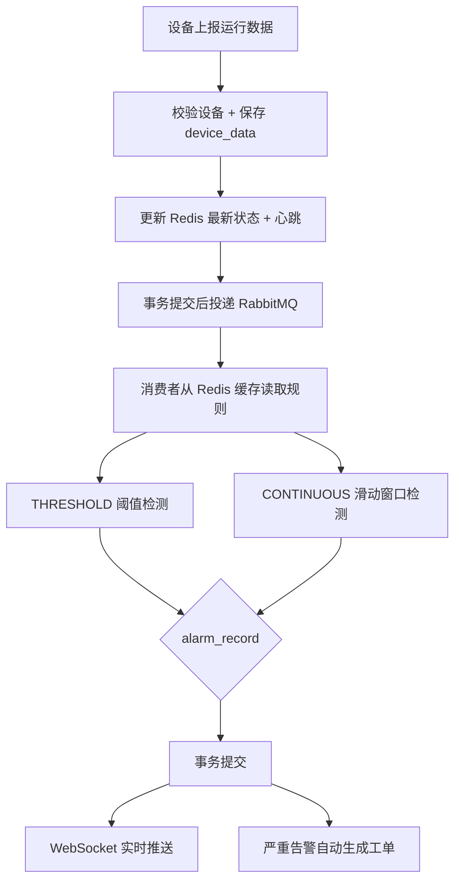
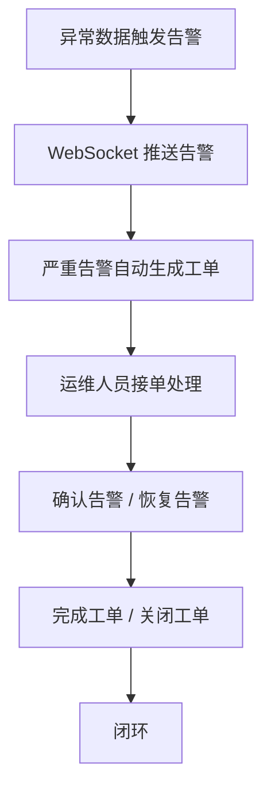

# 01-需求说明

## 1. 文档信息

| 项目 | 内容 |
|---|---|
| 项目名称 | 新能源充电设施运行监测与智能告警平台 |
| 后端项目名 | charge-monitor-backend |
| 数据库名 | charge_monitor |
| 文档版本 | v2.0 / 完整版 |
| 适用阶段 | 全部阶段已完成 |
| 编写目的 | 明确项目背景、目标用户、业务流程、功能边界与验收标准 |

---

## 2. 项目背景

随着新能源车辆和充电基础设施数量持续增长，充电桩、充电终端、站点配电设备等运行状态需要被持续监测。传统人工巡检方式存在响应慢、问题发现滞后、故障处理不可追踪等问题，难以满足集中化、数字化、智能化运维需求。

本项目面向新能源充电设施运维场景，建设一套后端管理平台，实现设备台账管理、运行数据上报、实时状态监测、异常告警、告警确认和统计分析等能力，为后续扩展工单闭环、WebSocket 实时推送、RabbitMQ 异步告警和运行日报奠定基础。

本项目围绕以下完整运维闭环展开：

```text
设备接入 → 数据采集 → 状态监测 → 异常告警 → 实时推送 → 自动工单 → 工单处理 → 报表复盘
```

---

## 3. 项目目标

### 3.1 业务目标

1. 建立充电设施设备台账，支持设备基础信息维护、状态查询和区域筛选。
2. 提供设备运行数据上报接口，模拟充电设施周期性上传运行指标。
3. 使用 MySQL 保存设备历史运行数据，支持后续查询与统计分析。
4. 使用 Redis 保存设备最新状态、在线设备集合和心跳信息，提高实时状态查询效率。
5. 基于阈值规则实现基础异常告警，支持告警记录生成、查询、确认和恢复。
6. 提供运行概览报表接口，展示设备总数、在线数、离线数、告警数量等关键指标。

### 3.2 技术目标

1. 使用 Spring Boot 构建单体后端项目，采用典型 Controller、Service、Mapper 分层结构。
2. 使用 MyBatis-Plus 简化基础 CRUD 和分页查询开发。
3. 使用 Sa-Token 实现登录认证与接口访问控制。
4. 使用 Redis 实现实时状态缓存，体现冷热数据分离设计。
5. 使用 Knife4j 生成接口文档，便于接口调试和展示。
6. 为第二阶段引入 RabbitMQ、WebSocket、工单流转、操作日志和定时报表预留扩展空间。

---

## 4. 目标用户

| 用户角色 | 角色说明 | 核心需求 |
|---|---|---|
| 系统管理员 | 负责系统基础配置和用户权限管理 | 用户管理、设备管理、告警查询、系统维护 |
| 运维人员 | 负责设备运行状态巡检与异常处理 | 查看设备状态、确认告警、恢复告警 |
| 调度人员 | 关注设备在线率、告警趋势和区域运行情况 | 查看实时状态、运行概览、告警统计 |
| 只读用户 | 仅查看系统运行情况 | 查询设备、查看报表、查看告警 |

MVP 第一版重点支持系统管理员和运维人员两类角色。

---

## 5. 核心业务流程

### 5.1 设备运行监测流程（当前实现）



### 5.2 告警处理流程



### 5.3 完整闭环

```text
登录认证 → 设备管理 → 数据上报 → Redis 状态缓存
→ RabbitMQ 异步 → 动态规则检测 → 告警记录
→ WebSocket 推送 → 自动工单 → 工单流转 → 报表概览
```

---

## 6. MVP 功能范围

### 6.1 认证模块

| 功能 | 描述 | MVP 是否包含 |
|---|---|---|
| 用户登录 | 用户通过用户名和密码登录系统 | 是 |
| 获取当前用户信息 | 根据 token 查询当前登录用户 | 是 |
| 用户退出 | 清除登录状态 | 是 |
| 角色权限控制 | 管理员、运维人员、只读用户基础区分 | 是 |
| 菜单权限 | 前端菜单级权限控制 | 否，第二阶段 |

### 6.2 用户与角色模块

| 功能 | 描述 | MVP 是否包含 |
|---|---|---|
| 用户表 | 保存系统用户基础信息 | 是 |
| 角色表 | 保存角色编码和角色名称 | 是 |
| 用户角色关联 | 支持用户与角色多对多关系 | 是 |
| 用户管理接口 | 用户增删改查 | 可选，MVP 可只初始化 admin 用户 |

### 6.3 设备管理模块

| 功能 | 描述 | MVP 是否包含 |
|---|---|---|
| 新增设备 | 添加充电设施设备信息 | 是 |
| 修改设备 | 修改设备名称、区域、状态、负责人等 | 是 |
| 删除设备 | 逻辑删除设备 | 是 |
| 分页查询设备 | 支持按编号、名称、区域、在线状态筛选 | 是 |
| 设备详情 | 查询单个设备完整信息 | 是 |
| 批量导入 | Excel 批量导入设备 | 否，第三阶段 |

### 6.4 设备数据上报模块

| 功能 | 描述 | MVP 是否包含 |
|---|---|---|
| 数据上报 | 接收设备电压、电流、功率、温度、SOC、网络延迟等指标 | 是 |
| 历史数据保存 | 将每条上报数据保存到 MySQL | 是 |
| 最新状态查询 | 优先从 Redis 查询设备最新状态 | 是 |
| 历史数据查询 | 按设备和时间范围分页查询历史数据 | 是 |
| 模拟设备上报 | 通过脚本或定时任务生成模拟数据 | 建议包含 |

### 6.5 实时状态缓存模块

| 功能 | 描述 | MVP 是否包含 |
|---|---|---|
| Redis 保存最新状态 | 保存设备最近一次运行数据 | 是 |
| Redis 保存心跳 | 保存设备最近上报时间 | 是 |
| 在线设备集合 | 维护当前在线设备编号集合 | 是 |
| 告警设备集合 | 维护当前存在告警的设备集合 | 是 |
| 离线检测 | 超过阈值未上报则标记离线 | MVP 可预留，第二阶段完善 |

### 6.6 告警模块

| 功能 | 描述 | MVP 是否包含 |
|---|---|---|
| 阈值告警 | 温度、电压、网络延迟等指标超过阈值触发告警 | 是 |
| 告警记录生成 | 触发异常后写入 alarm_record | 是 |
| 告警去重 | 未恢复告警不重复创建，只更新次数和最近时间 | 是 |
| 告警分页查询 | 按设备、类型、等级、状态、时间筛选 | 是 |
| 告警确认 | 运维人员确认告警 | 是 |
| 告警恢复 | 异常处理后恢复告警 | 是 |
| 可配置规则表 | 使用 alarm_rule 动态配置规则 | ✅ 已实现 |

### 6.7 报表模块

| 功能 | 描述 | MVP 是否包含 |
|---|---|---|
| 今日运行概览 | 设备总数、在线数、离线数、今日告警数等 | 是 |
| 告警统计 | 按等级、类型统计告警数量 | 可选 |
| 设备在线率 | 统计设备在线率 | 可选 |
| 运行日报 | 定时生成日报并入库 | 否，第二阶段 |

---

## 7. 已完成功能 vs 暂不实现

### 7.1 已实现

1. ✅ RabbitMQ 异步告警链路。
2. ✅ WebSocket 实时告警推送。
3. ✅ 工单自动生成与状态流转。
4. ✅ alarm_rule 动态规则引擎 + 管理接口。
5. ✅ Redis 规则缓存（Cache Aside）。
6. ✅ Redis 滑动窗口连续异常检测。
7. ✅ 设备离线检测定时任务。

### 7.2 暂不实现

1. 操作日志审计模块。
2. Docker Compose 一键部署。
3. Vue3 管理后台。
4. MQTT / Netty 真实设备协议接入。
5. 深度学习异常检测模型。

---

## 8. 数据指标定义

设备上报数据主要包括：

| 字段 | 中文含义 | 示例 | 说明 |
|---|---|---:|---|
| voltage | 电压 | 221.5 | 单位 V |
| current | 电流 | 32.4 | 单位 A |
| power | 功率 | 7.2 | 单位 kW |
| temperature | 温度 | 82.6 | 单位 ℃ |
| soc | 充电状态/电量百分比 | 68.5 | 单位 % |
| networkDelay | 网络延迟 | 90 | 单位 ms |
| faultCode | 故障码 | NORMAL | NORMAL 表示正常 |
| reportTime | 上报时间 | 2026-06-25 16:30:00 | 设备端数据时间 |

---

## 9. 非功能需求

### 9.1 可维护性

1. 项目采用清晰分层结构：Controller、Service、Mapper、Entity、DTO、VO。
2. 统一返回结果，统一异常处理。
3. 常量、枚举、Redis Key 统一管理。
4. 告警判断逻辑独立封装，方便第二阶段扩展动态规则。

### 9.2 可扩展性

1. 设备数据上报接口后续可扩展为 MQTT / Netty 接入。
2. 告警判断逻辑后续可从代码写死扩展为 alarm_rule 表动态配置。
3. 告警生成后续可接入 RabbitMQ，实现异步处理。
4. 告警事件后续可接入 WebSocket，实现实时推送。
5. 告警记录后续可自动生成工单，形成运维闭环。

### 9.3 安全性

1. 用户密码加密存储。
2. 登录后访问核心接口必须携带 token。
3. 删除设备采用逻辑删除，避免误删历史数据。
4. 告警确认、恢复等操作需要记录操作人。

### 9.4 性能要求

1. 最新状态查询优先读取 Redis，避免高频访问 MySQL。
2. 历史数据查询按设备编号和上报时间建立索引。
3. 分页接口必须支持 pageNo、pageSize，避免一次性查询大量数据。

---

## 10. 验收标准

MVP 第一版完成后，应满足以下标准：

| 编号 | 验收项 | 验收标准 |
|---|---|---|
| 1 | 项目启动 | Spring Boot 项目可以正常启动 |
| 2 | 数据库初始化 | MySQL 中存在 6 张 MVP 核心表和 demo 数据 |
| 3 | 登录认证 | admin 用户可以登录并访问受保护接口 |
| 4 | 设备管理 | 可以新增、修改、删除、分页查询设备 |
| 5 | 数据上报 | 可以通过接口上报设备运行数据 |
| 6 | 历史存储 | device_data 表中可以看到上报历史 |
| 7 | 实时状态 | Redis 中可以查询设备最新状态 |
| 8 | 告警触发 | 异常数据可以触发 alarm_record 记录 |
| 9 | 告警去重 | 同一未恢复告警不会重复刷屏 |
| 10 | 告警处理 | 可以确认和恢复告警 |
| 11 | 报表概览 | 可以查询设备总数、在线数、今日告警数等 |
| 12 | 接口文档 | Knife4j 文档页面可以访问 |

---

## 11. 当前状态

项目全部 7 个阶段已完成：

```text
✅ 第一阶段：基础后台 MVP（登录、设备管理、数据上报、阈值告警、报表）
✅ 第二阶段：动态规则 + RabbitMQ 异步告警 + 离线检测
✅ 第三阶段：告警规则管理模块（7 个 CRUD 接口）
✅ 第四阶段：Redis 规则缓存（Cache Aside）
✅ 第五阶段：连续异常告警（Redis 滑动窗口）
✅ 第六阶段：WebSocket 实时告警推送
✅ 第七阶段：自动工单生成 + 工单状态流转管理
```

### 后续可选优化

1. 操作日志审计模块（AOP）
2. Docker Compose 一键部署
3. Vue3 + Element Plus 管理后台
4. Prometheus + Grafana 监控
5. RabbitMQ 死信队列
