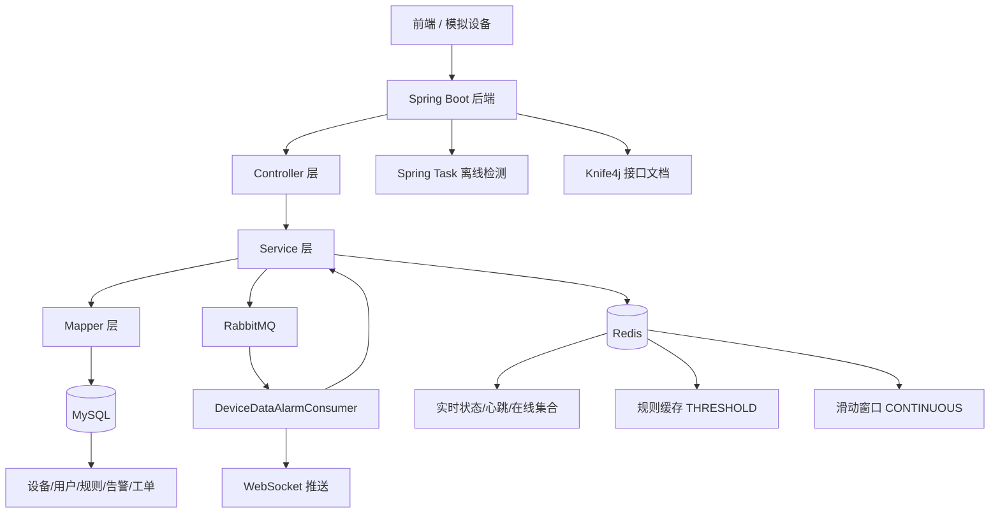
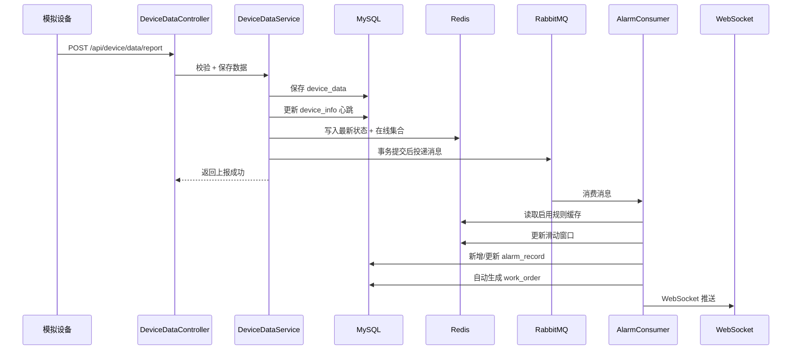
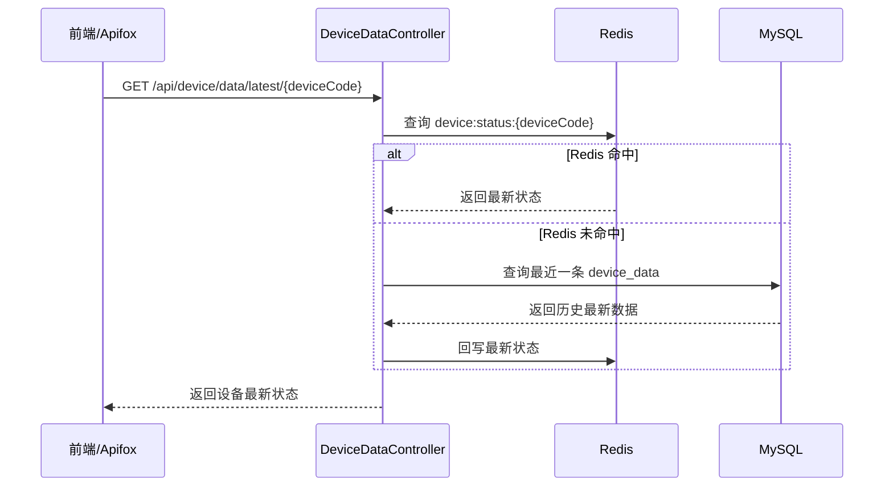

# 02-系统架构设计

## 1. 文档信息

| 项目 | 内容 |
|---|---|
| 项目名称 | 新能源充电设施运行监测与智能告警平台 |
| 后端项目名 | charge-monitor-backend |
| 文档版本 | v2.0 / 完整版 |
| 适用阶段 | 全部阶段已完成 |
| 编写目的 | 明确系统整体架构、分层结构、技术选型、数据流转 |

---

## 2. 架构设计原则

MVP 第一版采用单体分层架构，不做微服务拆分。当前目标不是追求复杂技术栈，而是保证核心链路清晰、代码可运行、接口可测试、面试能讲清楚。

设计原则如下：

1. **单体优先**：第一阶段使用 Spring Boot 单体项目，降低开发和部署复杂度。
2. **分层清晰**：Controller、Service、Mapper、Entity、DTO、VO 分层明确。
3. **冷热分离**：MySQL 保存历史数据，Redis 保存设备最新状态。
4. **告警可扩展**：MVP 先实现代码内阈值规则，第二阶段扩展为可配置规则表。
5. **接口可测试**：通过 Knife4j 暴露接口文档，便于调试和展示。
6. **逐步增强**：RabbitMQ、WebSocket、工单流转、Docker 在第二阶段逐步引入。

---

## 3. 技术架构总览



核心增强点：

| 组件 | 作用 | 状态 |
|---|---|---|
| RabbitMQ | 解耦数据上报与告警检测 | ✅ |
| WebSocket | 告警实时推送 | ✅ |
| Spring Task | 定时检测设备离线 | ✅ |
| 工单模块 | 严重告警自动建单 + 状态流转 | ✅ |
| Redis 规则缓存 | Cache Aside 模式缓存启用规则 | ✅ |
| Redis 滑动窗口 | 连续异常检测 | ✅ |

---

## 4. 技术选型

### 4.1 技术栈

| 技术 | 版本 | 用途 |
|---|---|---|
| JDK | 17 | 运行环境 |
| Spring Boot | 3.3.13 | 后端主框架 |
| MyBatis-Plus | 3.5.16 | ORM / 分页 / 逻辑删除 |
| MySQL | 8.0+ | 业务数据存储 |
| Redis | 6/7 | 缓存 / 滑动窗口 / 实时状态 |
| RabbitMQ | 3.x | 异步告警消息队列 |
| WebSocket | Spring 原生 | 告警实时推送 |
| Sa-Token | 1.45.0 | 登录认证 |
| Knife4j | 4.5.0 | 接口文档 |
| Spring Task | — | 离线检测定时任务 |

---

## 5. 后端项目结构

推荐包结构如下：

```text
charge-monitor-backend
└── src/main/java/com/liyancong/charge/monitor
    ├── ChargeMonitorApplication.java
    │
    ├── common
    │   ├── result
    │   │   ├── Result.java
    │   │   └── ResultCode.java
    │   ├── exception
    │   │   ├── GlobalExceptionHandler.java
    │   │   └── BusinessException.java
    │   └── constants
    │       ├── RedisKeyConstants.java
    │       └── SystemConstants.java
    │
    ├── config
    │   ├── MybatisPlusConfig.java
    │   ├── RedisConfig.java
    │   ├── SaTokenConfig.java
    │   └── Knife4jConfig.java
    │
    ├── module
    │   ├── auth/       # 登录认证
    │   ├── device/     # 设备管理 + 数据上报
    │   ├── alarm/      # 告警检测 + 规则管理 + MQ + WebSocket
    │   ├── report/     # 运行概览报表
    │   └── workorder/  # 工单管理 + 自动生成
    ├── task/           # 设备离线检测
    └── simulator/      # 设备数据模拟器

---

## 6. 分层职责说明

| 层级 | 职责 |
|---|---|
| Controller | 接收 HTTP 请求，参数校验，调用 Service，返回统一结果 |
| Service | 编写业务逻辑，如数据上报、告警判断、状态更新 |
| Mapper | 使用 MyBatis-Plus 访问数据库 |
| Entity | 与数据库表字段对应 |
| DTO | 接收前端请求参数 |
| VO | 返回给前端的数据视图 |
| Config | MyBatis-Plus、Redis、Sa-Token、Knife4j 等配置 |
| Common | 统一返回、异常、常量、工具类 |
| Task | 定时任务，MVP 可预留，第二阶段完善 |
| Simulator | 模拟设备上报数据，便于测试 |

---

## 7. 核心模块架构

### 7.1 认证模块

职责：

1. 用户登录。
2. 生成登录态 token。
3. 查询当前用户信息。
4. 用户退出登录。
5. 接口访问鉴权。

数据表：

```text
sys_user
sys_role
sys_user_role
```

关键接口：

```text
POST /api/auth/login
GET  /api/auth/userInfo
POST /api/auth/logout
```

---

### 7.2 设备管理模块

职责：

1. 维护充电设施设备台账。
2. 支持设备新增、修改、逻辑删除。
3. 支持分页查询和条件筛选。
4. 维护设备在线状态、运行状态、最近心跳时间。

数据表：

```text
device_info
```

关键接口：

```text
POST   /api/device
PUT    /api/device/{id}
DELETE /api/device/{id}
GET    /api/device/page
GET    /api/device/{id}
```

---

### 7.3 设备数据上报模块

职责：

1. 接收设备上报的运行数据。
2. 校验设备编号是否存在。
3. 保存历史运行数据到 MySQL。
4. 更新设备最近心跳和在线状态。
5. 更新 Redis 最新状态。
6. 同步执行基础阈值告警判断。

数据表：

```text
device_data
device_info
alarm_record
```

Redis Key：

```text
device:status:{deviceCode}
device:heartbeat:{deviceCode}
device:online:set
device:alarm:set
```

关键接口：

```text
POST /api/device/data/report
GET  /api/device/data/latest/{deviceCode}
GET  /api/device/data/history
```

---

### 7.4 实时状态缓存模块

职责：

1. 将设备最新状态写入 Redis。
2. 将在线设备加入 Redis Set。
3. 将当前存在告警的设备加入 Redis Set。
4. 支持从 Redis 快速查询最新状态。

Redis 设计：

| Key | 类型 | 说明 |
|---|---|---|
| device:status:{deviceCode} | String | 设备最新运行状态 |
| device:heartbeat:{deviceCode} | String | 设备最近心跳时间 |
| device:online:set | Set | 当前在线设备集合 |
| device:alarm:set | Set | 当前告警设备集合 |
| alarm:rule:enabled:THRESHOLD | String | 启用阈值规则缓存 |
| alarm:continuous:window:{deviceCode}:{ruleCode} | List | 连续异常滑动窗口 |

---

### 7.5 告警模块

职责：

1. 接收数据上报后的指标值。
2. 判断是否触发阈值告警。
3. 判断是否存在未恢复告警。
4. 新增告警或更新告警次数。
5. 支持告警查询、确认、恢复。

数据表：

```text
alarm_record
```

关键接口：

```text
GET /api/alarm/record/page
GET /api/alarm/record/{id}
PUT /api/alarm/record/{id}/ack
PUT /api/alarm/record/{id}/recover
```

---

### 7.6 报表模块

职责：

1. 查询设备总数。
2. 查询在线、离线设备数。
3. 查询今日告警总数。
4. 查询严重告警数和未处理告警数。

关键接口：

```text
GET /api/report/overview
GET /api/report/alarm/stat
GET /api/report/device/online
```

---

## 8. 数据流转设计

### 8.1 设备数据上报数据流（当前实现）



### 8.2 查询设备最新状态数据流



---

## 9. MySQL 与 Redis 分工

| 数据类型 | 存储位置 | 原因 |
|---|---|---|
| 用户、角色 | MySQL | 关系清晰、事务一致性要求较高 |
| 设备台账 | MySQL | 需要持久化、分页查询、条件筛选 |
| 历史运行数据 | MySQL | 需要长期保存和按时间查询 |
| 告警记录 | MySQL | 需要追溯、确认、恢复和统计 |
| 设备最新状态 | Redis | 高频查询、只关心最近一次数据 |
| 在线设备集合 | Redis | 集合统计快，适合实时展示 |
| 告警设备集合 | Redis | 快速查询当前异常设备 |
| 心跳时间 | Redis | 便于离线检测和过期判断 |

---

## 10. 统一返回与异常处理

### 10.1 统一返回格式

建议所有接口统一返回：

```json
{
  "code": 200,
  "message": "success",
  "data": {}
}
```

### 10.2 常见状态码

| code | 含义 |
|---:|---|
| 200 | 请求成功 |
| 400 | 请求参数错误 |
| 401 | 未登录或 token 无效 |
| 403 | 无权限访问 |
| 404 | 数据不存在 |
| 500 | 系统内部错误 |

### 10.3 全局异常处理

统一处理：

1. 参数校验异常。
2. 业务异常。
3. 登录认证异常。
4. 数据库访问异常。
5. 未知系统异常。

---

## 11. 配置文件规划

`application.yml` 建议包含：

```yaml
server:
  port: 8080

spring:
  datasource:
    url: jdbc:mysql://localhost:3306/charge_monitor?useUnicode=true&characterEncoding=utf-8&serverTimezone=Asia/Shanghai
    username: root
    password: root
  data:
    redis:
      host: localhost
      port: 6379
      database: 0

mybatis-plus:
  configuration:
    log-impl: org.apache.ibatis.logging.stdout.StdOutImpl
  global-config:
    db-config:
      logic-delete-field: deleted
      logic-delete-value: 1
      logic-not-delete-value: 0

sa-token:
  token-name: Authorization
  timeout: 86400
  is-concurrent: true
  token-prefix: Bearer
```

---

## 12. 扩展点设计

### 12.1 RabbitMQ 扩展点

MVP 当前流程：

```text
数据上报接口 → 同步判断告警
```

第二阶段目标流程：

```text
数据上报接口 → 快速入库/缓存 → 发送 MQ 消息 → 消费者异步判断告警
```

预留方式：

1. 将告警判断封装为独立 `AlarmDetectService`。
2. 数据上报 Service 只调用告警服务，不直接写复杂判断。
3. 第二阶段将调用方式替换为 MQ 投递。

### 12.2 WebSocket 扩展点

MVP 当前流程：

```text
告警生成 → 前端主动查询
```

第二阶段目标流程：

```text
告警生成 → WebSocket 主动推送前端
```

预留方式：

1. 告警生成后封装 `AlarmEvent`。
2. 后续由 WebSocket 服务订阅并推送。

### 12.3 工单扩展点

MVP 当前流程：

```text
告警生成 → 运维人员确认/恢复
```

第二阶段目标流程：

```text
告警生成 → 自动建单 → 派发 → 处理 → 确认 → 关闭
```

预留方式：

1. `alarm_record` 表中预留 `work_order_id` 或 `work_order_created` 字段。
2. 告警恢复时可同步影响后续工单状态。

---

## 13. MVP 开发顺序建议

```text
1. 创建 Spring Boot 项目骨架
2. 完成 pom.xml 和 application.yml
3. 编写统一返回和全局异常处理
4. 初始化 MySQL 表结构和 demo 数据
5. 完成登录认证模块
6. 完成设备管理模块
7. 完成设备数据上报模块
8. 完成 Redis 最新状态缓存
9. 完成基础阈值告警模块
10. 完成告警查询、确认、恢复
11. 完成运行概览报表
12. 接入 Knife4j 接口文档
```

---

## 14. 架构总结

当前系统架构：

```text
Spring Boot 单体后端
+ MyBatis-Plus 操作 MySQL
+ Redis 缓存实时状态 / 规则缓存 / 滑动窗口
+ RabbitMQ 异步告警
+ WebSocket 实时推送
+ Sa-Token 认证 + Knife4j 接口文档
+ alarm_rule 动态规则 + 连续异常检测
+ 自动工单 + 状态流转
```

完整链路：**设备上报 → 异步检测 → 实时推送 → 自动工单 → 工单处理**。
