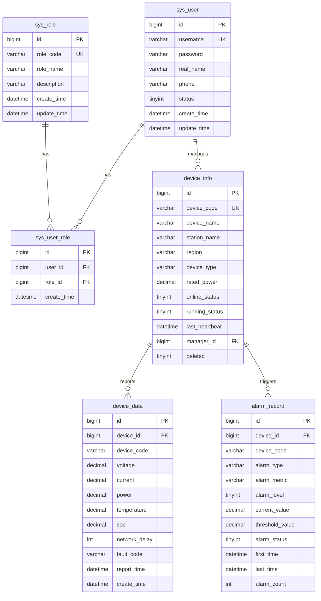

# 03-数据库设计

## 1. 文档信息

| 项目 | 内容 |
|---|---|
| 项目名称 | 新能源充电设施运行监测与智能告警平台 |
| 数据库名 | charge_monitor |
| 文档版本 | v1.0 / MVP 第一版 |
| 适用阶段 | 第一阶段：MVP 开发 |
| 编写目的 | 明确 MVP 数据库表结构、字段含义、索引设计和后续扩展方向 |

---

## 2. 数据库设计原则

1. **先小后大**：MVP 第一版只设计核心 6 张表，避免一开始设计过重。
2. **支撑核心闭环**：表结构围绕登录、设备、数据、告警四类核心能力展开。
3. **保留扩展空间**：为第二阶段扩展告警规则、工单、操作日志、日报统计预留方向。
4. **查询优先考虑索引**：设备历史数据和告警记录按设备、时间高频查询，需要建立组合索引。
5. **重要数据逻辑删除**：设备台账采用逻辑删除，避免误删影响历史数据追溯。
6. **统一时间字段**：核心表保留 `create_time`、`update_time`，便于审计和排查问题。

---

## 3. MVP 表清单

MVP 第一版共 6 张核心表：

| 表名 | 中文名 | 是否必须 | 作用 |
|---|---|---|---|
| sys_user | 用户表 | 是 | 登录认证、用户身份 |
| sys_role | 角色表 | 是 | 管理员、运维人员、只读用户等角色 |
| sys_user_role | 用户角色关联表 | 是 | 用户与角色多对多关系 |
| device_info | 设备信息表 | 是 | 充电桩/终端设备台账 |
| device_data | 设备运行数据表 | 是 | 保存设备历史遥测数据 |
| alarm_record | 告警记录表 | 是 | 保存异常告警记录、状态和次数 |

第二阶段再扩展：

| 表名 | 中文名 | 阶段 | 说明 |
|---|---|---|---|
| alarm_rule | 告警规则表 | 第二阶段 | 动态配置阈值、连续异常、波动规则 |
| work_order | 工单表 | 第二阶段 | 告警自动建单和工单流转 |
| work_order_log | 工单流转日志表 | 第二阶段 | 记录工单状态变化 |
| operation_log | 操作日志表 | 第二阶段 | 记录关键操作审计 |
| daily_report | 运行日报表 | 第二阶段 | 设备在线率、告警数、工单闭环率等统计 |

---

## 4. ER 关系概览



---

## 5. 表结构设计

## 5.1 sys_user 用户表

### 表说明

保存系统登录用户信息。MVP 阶段至少初始化一个 `admin` 用户。

### 字段设计

| 字段名 | 类型 | 约束 | 说明 |
|---|---|---|---|
| id | bigint | PK | 主键 ID |
| username | varchar(50) | NOT NULL, UNIQUE | 用户名 |
| password | varchar(100) | NOT NULL | 密码，建议加密存储 |
| real_name | varchar(50) |  | 真实姓名 |
| phone | varchar(20) |  | 手机号 |
| status | tinyint | NOT NULL DEFAULT 1 | 状态：0 禁用，1 启用 |
| create_time | datetime | NOT NULL | 创建时间 |
| update_time | datetime | NOT NULL | 更新时间 |

### 建表 SQL

```sql
CREATE TABLE sys_user (
    id BIGINT PRIMARY KEY AUTO_INCREMENT COMMENT '主键ID',
    username VARCHAR(50) NOT NULL COMMENT '用户名',
    password VARCHAR(100) NOT NULL COMMENT '密码',
    real_name VARCHAR(50) DEFAULT NULL COMMENT '真实姓名',
    phone VARCHAR(20) DEFAULT NULL COMMENT '手机号',
    status TINYINT NOT NULL DEFAULT 1 COMMENT '状态：0禁用，1启用',
    create_time DATETIME NOT NULL DEFAULT CURRENT_TIMESTAMP COMMENT '创建时间',
    update_time DATETIME NOT NULL DEFAULT CURRENT_TIMESTAMP ON UPDATE CURRENT_TIMESTAMP COMMENT '更新时间',
    UNIQUE KEY uk_username (username)
) COMMENT='用户表';
```

---

## 5.2 sys_role 角色表

### 表说明

保存系统角色信息。MVP 推荐初始化三类角色：

| 角色编码 | 角色名称 | 说明 |
|---|---|---|
| admin | 系统管理员 | 拥有全部权限 |
| operator | 运维人员 | 查看设备、确认告警、恢复告警 |
| viewer | 只读用户 | 只读查询 |

### 字段设计

| 字段名 | 类型 | 约束 | 说明 |
|---|---|---|---|
| id | bigint | PK | 主键 ID |
| role_code | varchar(50) | NOT NULL, UNIQUE | 角色编码 |
| role_name | varchar(50) | NOT NULL | 角色名称 |
| description | varchar(255) |  | 角色说明 |
| create_time | datetime | NOT NULL | 创建时间 |
| update_time | datetime | NOT NULL | 更新时间 |

### 建表 SQL

```sql
CREATE TABLE sys_role (
    id BIGINT PRIMARY KEY AUTO_INCREMENT COMMENT '主键ID',
    role_code VARCHAR(50) NOT NULL COMMENT '角色编码',
    role_name VARCHAR(50) NOT NULL COMMENT '角色名称',
    description VARCHAR(255) DEFAULT NULL COMMENT '角色描述',
    create_time DATETIME NOT NULL DEFAULT CURRENT_TIMESTAMP COMMENT '创建时间',
    update_time DATETIME NOT NULL DEFAULT CURRENT_TIMESTAMP ON UPDATE CURRENT_TIMESTAMP COMMENT '更新时间',
    UNIQUE KEY uk_role_code (role_code)
) COMMENT='角色表';
```

---

## 5.3 sys_user_role 用户角色关联表

### 表说明

保存用户和角色之间的多对多关系。

### 字段设计

| 字段名 | 类型 | 约束 | 说明 |
|---|---|---|---|
| id | bigint | PK | 主键 ID |
| user_id | bigint | NOT NULL | 用户 ID |
| role_id | bigint | NOT NULL | 角色 ID |
| create_time | datetime | NOT NULL | 创建时间 |

### 建表 SQL

```sql
CREATE TABLE sys_user_role (
    id BIGINT PRIMARY KEY AUTO_INCREMENT COMMENT '主键ID',
    user_id BIGINT NOT NULL COMMENT '用户ID',
    role_id BIGINT NOT NULL COMMENT '角色ID',
    create_time DATETIME NOT NULL DEFAULT CURRENT_TIMESTAMP COMMENT '创建时间',
    UNIQUE KEY uk_user_role (user_id, role_id),
    KEY idx_user_id (user_id),
    KEY idx_role_id (role_id)
) COMMENT='用户角色关联表';
```

---

## 5.4 device_info 设备信息表

### 表说明

保存充电设施设备台账信息，是设备管理、运行监测和告警处理的基础表。

### 字段设计

| 字段名 | 类型 | 约束 | 说明 |
|---|---|---|---|
| id | bigint | PK | 主键 ID |
| device_code | varchar(64) | NOT NULL, UNIQUE | 设备编号 |
| device_name | varchar(100) | NOT NULL | 设备名称 |
| station_name | varchar(100) |  | 所属站点 |
| region | varchar(50) |  | 所属区域 |
| device_type | varchar(50) |  | 设备类型：AC / DC |
| rated_power | decimal(10,2) |  | 额定功率，单位 kW |
| longitude | decimal(10,6) |  | 经度 |
| latitude | decimal(10,6) |  | 纬度 |
| online_status | tinyint | DEFAULT 0 | 在线状态：0 离线，1 在线 |
| running_status | tinyint | DEFAULT 1 | 运行状态：0 停用，1 正常，2 异常 |
| last_heartbeat | datetime |  | 最近心跳时间 |
| manager_id | bigint |  | 负责人用户 ID |
| create_time | datetime | NOT NULL | 创建时间 |
| update_time | datetime | NOT NULL | 更新时间 |
| deleted | tinyint | DEFAULT 0 | 逻辑删除：0 未删，1 已删 |

### 建表 SQL

```sql
CREATE TABLE device_info (
    id BIGINT PRIMARY KEY AUTO_INCREMENT COMMENT '主键ID',
    device_code VARCHAR(64) NOT NULL COMMENT '设备编号',
    device_name VARCHAR(100) NOT NULL COMMENT '设备名称',
    station_name VARCHAR(100) DEFAULT NULL COMMENT '所属站点',
    region VARCHAR(50) DEFAULT NULL COMMENT '所属区域',
    device_type VARCHAR(50) DEFAULT NULL COMMENT '设备类型：AC/DC',
    rated_power DECIMAL(10,2) DEFAULT NULL COMMENT '额定功率kW',
    longitude DECIMAL(10,6) DEFAULT NULL COMMENT '经度',
    latitude DECIMAL(10,6) DEFAULT NULL COMMENT '纬度',
    online_status TINYINT NOT NULL DEFAULT 0 COMMENT '在线状态：0离线，1在线',
    running_status TINYINT NOT NULL DEFAULT 1 COMMENT '运行状态：0停用，1正常，2异常',
    last_heartbeat DATETIME DEFAULT NULL COMMENT '最近心跳时间',
    manager_id BIGINT DEFAULT NULL COMMENT '负责人ID',
    create_time DATETIME NOT NULL DEFAULT CURRENT_TIMESTAMP COMMENT '创建时间',
    update_time DATETIME NOT NULL DEFAULT CURRENT_TIMESTAMP ON UPDATE CURRENT_TIMESTAMP COMMENT '更新时间',
    deleted TINYINT NOT NULL DEFAULT 0 COMMENT '逻辑删除：0未删，1已删',
    UNIQUE KEY uk_device_code (device_code),
    KEY idx_region (region),
    KEY idx_online_status (online_status),
    KEY idx_running_status (running_status),
    KEY idx_manager_id (manager_id)
) COMMENT='设备信息表';
```

---

## 5.5 device_data 设备运行数据表

### 表说明

保存设备周期性上报的历史运行数据。该表数据量会不断增长，是后续报表统计和异常分析的基础。

### 字段设计

| 字段名 | 类型 | 约束 | 说明 |
|---|---|---|---|
| id | bigint | PK | 主键 ID |
| device_id | bigint | NOT NULL | 设备 ID |
| device_code | varchar(64) | NOT NULL | 设备编号 |
| voltage | decimal(10,2) |  | 电压，单位 V |
| current | decimal(10,2) |  | 电流，单位 A |
| power | decimal(10,2) |  | 功率，单位 kW |
| temperature | decimal(10,2) |  | 温度，单位 ℃ |
| soc | decimal(5,2) |  | 充电状态/电量百分比 |
| network_delay | int |  | 网络延迟，单位 ms |
| fault_code | varchar(50) |  | 故障码 |
| report_time | datetime | NOT NULL | 设备上报时间 |
| create_time | datetime | NOT NULL | 数据入库时间 |

### 建表 SQL

```sql
CREATE TABLE device_data (
    id BIGINT PRIMARY KEY AUTO_INCREMENT COMMENT '主键ID',
    device_id BIGINT NOT NULL COMMENT '设备ID',
    device_code VARCHAR(64) NOT NULL COMMENT '设备编号',
    voltage DECIMAL(10,2) DEFAULT NULL COMMENT '电压V',
    current DECIMAL(10,2) DEFAULT NULL COMMENT '电流A',
    power DECIMAL(10,2) DEFAULT NULL COMMENT '功率kW',
    temperature DECIMAL(10,2) DEFAULT NULL COMMENT '温度℃',
    soc DECIMAL(5,2) DEFAULT NULL COMMENT '充电状态/电量百分比',
    network_delay INT DEFAULT NULL COMMENT '网络延迟ms',
    fault_code VARCHAR(50) DEFAULT NULL COMMENT '故障码',
    report_time DATETIME NOT NULL COMMENT '上报时间',
    create_time DATETIME NOT NULL DEFAULT CURRENT_TIMESTAMP COMMENT '创建时间',
    KEY idx_device_time (device_id, report_time),
    KEY idx_code_time (device_code, report_time),
    KEY idx_report_time (report_time)
) COMMENT='设备运行数据表';
```

### 索引说明

| 索引 | 字段 | 用途 |
|---|---|---|
| idx_device_time | device_id, report_time | 根据设备 ID 和时间范围查询历史数据 |
| idx_code_time | device_code, report_time | 根据设备编号和时间范围查询历史数据 |
| idx_report_time | report_time | 按时间统计运行数据 |

---

## 5.6 alarm_record 告警记录表

### 表说明

保存设备异常告警记录，包括告警类型、告警指标、告警等级、当前值、阈值、状态和发生次数。

### 字段设计

| 字段名 | 类型 | 约束 | 说明 |
|---|---|---|---|
| id | bigint | PK | 主键 ID |
| device_id | bigint | NOT NULL | 设备 ID |
| device_code | varchar(64) | NOT NULL | 设备编号 |
| alarm_type | varchar(50) | NOT NULL | 告警类型：THRESHOLD / OFFLINE / CONTINUOUS |
| alarm_metric | varchar(50) | NOT NULL | 告警指标：temperature / voltage / network_delay |
| alarm_level | tinyint | NOT NULL | 告警等级：1 一般，2 重要，3 严重 |
| current_value | decimal(10,2) |  | 当前值 |
| threshold_value | decimal(10,2) |  | 阈值 |
| alarm_message | varchar(255) |  | 告警描述 |
| alarm_status | tinyint | DEFAULT 0 | 状态：0 未确认，1 已确认，2 已恢复 |
| first_time | datetime | NOT NULL | 首次发生时间 |
| last_time | datetime | NOT NULL | 最近发生时间 |
| alarm_count | int | DEFAULT 1 | 发生次数 |
| ack_user_id | bigint |  | 确认人 ID |
| ack_time | datetime |  | 确认时间 |
| recover_time | datetime |  | 恢复时间 |
| create_time | datetime | NOT NULL | 创建时间 |
| update_time | datetime | NOT NULL | 更新时间 |

### 建表 SQL

```sql
CREATE TABLE alarm_record (
    id BIGINT PRIMARY KEY AUTO_INCREMENT COMMENT '主键ID',
    device_id BIGINT NOT NULL COMMENT '设备ID',
    device_code VARCHAR(64) NOT NULL COMMENT '设备编号',
    alarm_type VARCHAR(50) NOT NULL COMMENT '告警类型：THRESHOLD/OFFLINE/CONTINUOUS',
    alarm_metric VARCHAR(50) NOT NULL COMMENT '告警指标',
    alarm_level TINYINT NOT NULL COMMENT '告警等级：1一般，2重要，3严重',
    current_value DECIMAL(10,2) DEFAULT NULL COMMENT '当前值',
    threshold_value DECIMAL(10,2) DEFAULT NULL COMMENT '阈值',
    alarm_message VARCHAR(255) DEFAULT NULL COMMENT '告警描述',
    alarm_status TINYINT NOT NULL DEFAULT 0 COMMENT '状态：0未确认，1已确认，2已恢复',
    first_time DATETIME NOT NULL COMMENT '首次发生时间',
    last_time DATETIME NOT NULL COMMENT '最近发生时间',
    alarm_count INT NOT NULL DEFAULT 1 COMMENT '发生次数',
    ack_user_id BIGINT DEFAULT NULL COMMENT '确认人ID',
    ack_time DATETIME DEFAULT NULL COMMENT '确认时间',
    recover_time DATETIME DEFAULT NULL COMMENT '恢复时间',
    create_time DATETIME NOT NULL DEFAULT CURRENT_TIMESTAMP COMMENT '创建时间',
    update_time DATETIME NOT NULL DEFAULT CURRENT_TIMESTAMP ON UPDATE CURRENT_TIMESTAMP COMMENT '更新时间',
    KEY idx_device_status (device_id, alarm_status),
    KEY idx_code_time (device_code, last_time),
    KEY idx_alarm_query (alarm_type, alarm_level, alarm_status),
    KEY idx_metric_status (device_id, alarm_metric, alarm_type, alarm_status)
) COMMENT='告警记录表';
```

### 索引说明

| 索引 | 字段 | 用途 |
|---|---|---|
| idx_device_status | device_id, alarm_status | 查询某设备未恢复告警 |
| idx_code_time | device_code, last_time | 按设备编号和时间查询告警 |
| idx_alarm_query | alarm_type, alarm_level, alarm_status | 告警分页筛选 |
| idx_metric_status | device_id, alarm_metric, alarm_type, alarm_status | 告警去重查询 |

---

## 6. 枚举字段说明

### 6.1 设备类型 device_type

| 值 | 含义 |
|---|---|
| AC | 交流充电桩 |
| DC | 直流充电桩 |

### 6.2 在线状态 online_status

| 值 | 含义 |
|---:|---|
| 0 | 离线 |
| 1 | 在线 |

### 6.3 运行状态 running_status

| 值 | 含义 |
|---:|---|
| 0 | 停用 |
| 1 | 正常 |
| 2 | 异常 |

### 6.4 告警类型 alarm_type

| 值 | 含义 | MVP 是否使用 |
|---|---|---|
| THRESHOLD | 阈值告警 | 是 |
| OFFLINE | 离线告警 | 第二阶段完善 |
| CONTINUOUS | 连续异常告警 | 第二阶段完善 |
| FLUCTUATION | 波动异常告警 | 第二阶段完善 |
| COMBINATION | 组合告警 | 第三阶段可选 |

### 6.5 告警指标 alarm_metric

| 值 | 含义 |
|---|---|
| temperature | 温度 |
| voltage | 电压 |
| current | 电流 |
| power | 功率 |
| network_delay | 网络延迟 |

### 6.6 告警等级 alarm_level

| 值 | 含义 | 处理建议 |
|---:|---|---|
| 1 | 一般 | 观察或低优先级处理 |
| 2 | 重要 | 需要运维人员关注 |
| 3 | 严重 | 需要立即处理 |

### 6.7 告警状态 alarm_status

| 值 | 含义 |
|---:|---|
| 0 | 未确认 |
| 1 | 已确认 |
| 2 | 已恢复 |

---

## 7. 初始化数据建议

### 7.1 初始化角色

```sql
INSERT INTO sys_role (id, role_code, role_name, description) VALUES
(1, 'admin', '系统管理员', '拥有系统全部权限'),
(2, 'operator', '运维人员', '负责设备告警确认和处理'),
(3, 'viewer', '只读用户', '只能查看设备状态和报表');
```

### 7.2 初始化用户

密码字段应在实际项目中使用 BCrypt 或 Sa-Token 配套方式加密。MVP 初期可先使用固定密文或临时明文，后续必须改为加密存储。

```sql
INSERT INTO sys_user (id, username, password, real_name, phone, status) VALUES
(1, 'admin', '123456', '系统管理员', '13800000000', 1);

INSERT INTO sys_user_role (user_id, role_id) VALUES
(1, 1);
```

### 7.3 初始化设备

```sql
INSERT INTO device_info
(device_code, device_name, station_name, region, device_type, rated_power, longitude, latitude, online_status, running_status, manager_id)
VALUES
('CP-0001', '一号直流充电桩', '城东充电站', '城东区域', 'DC', 120.00, 120.123456, 30.123456, 0, 1, 1),
('CP-0002', '二号直流充电桩', '城东充电站', '城东区域', 'DC', 120.00, 120.123556, 30.123556, 0, 1, 1),
('CP-0003', '一号交流充电桩', '城西充电站', '城西区域', 'AC', 7.00, 120.223456, 30.223456, 0, 1, 1),
('CP-0004', '二号交流充电桩', '城西充电站', '城西区域', 'AC', 7.00, 120.223556, 30.223556, 0, 1, 1),
('CP-0005', '高速服务区充电桩', '高速服务区站', '高速区域', 'DC', 180.00, 120.323456, 30.323456, 0, 1, 1);
```

---

## 8. 第二阶段扩展表设计方向

### 8.1 alarm_rule 告警规则表

用于将 MVP 中写死的规则改为动态配置。

核心字段：

```text
id
rule_name
alarm_type
metric_name
operator
threshold_value
window_size
trigger_count
alarm_level
enabled
create_time
update_time
```

### 8.2 work_order 工单表

用于告警生成后自动创建工单。

核心字段：

```text
id
alarm_id
device_id
order_title
order_level
order_status
assignee_id
create_time
assign_time
process_time
close_time
process_result
```

### 8.3 work_order_log 工单流转日志表

用于记录工单状态变化。

核心字段：

```text
id
work_order_id
operator_id
action_type
before_status
after_status
remark
create_time
```

### 8.4 operation_log 操作日志表

用于审计关键操作。

核心字段：

```text
id
user_id
username
operation_type
module_name
request_url
request_method
request_param
ip_address
create_time
```

### 8.5 daily_report 运行日报表

用于保存定时统计结果。

核心字段：

```text
id
report_date
device_total
online_count
offline_count
alarm_total
serious_alarm_count
unhandled_alarm_count
work_order_total
closed_work_order_count
avg_process_minutes
create_time
```

---

## 9. 数据库设计总结

MVP 第一版数据库只保留最核心的 6 张表，能支撑以下闭环：

```text
用户登录 → 设备管理 → 数据上报 → 历史存储 → 告警生成 → 告警处理 → 概览统计
```

其中：

1. `device_info` 是设备台账核心。
2. `device_data` 是运行数据历史核心。
3. `alarm_record` 是异常告警核心。
4. `sys_user`、`sys_role`、`sys_user_role` 是后台系统基础权限核心。

后续只要在此基础上增加 `alarm_rule`、`work_order`、`operation_log` 和 `daily_report`，即可平滑升级为完整简历版本。
