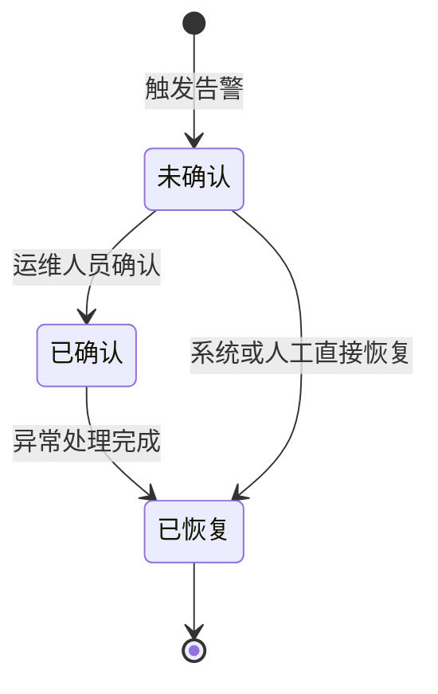
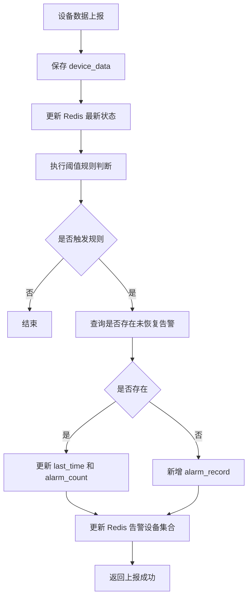
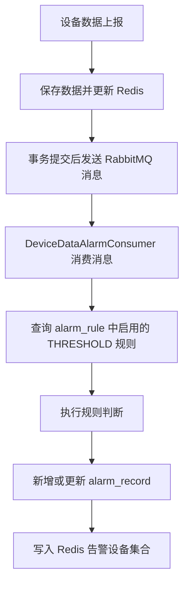
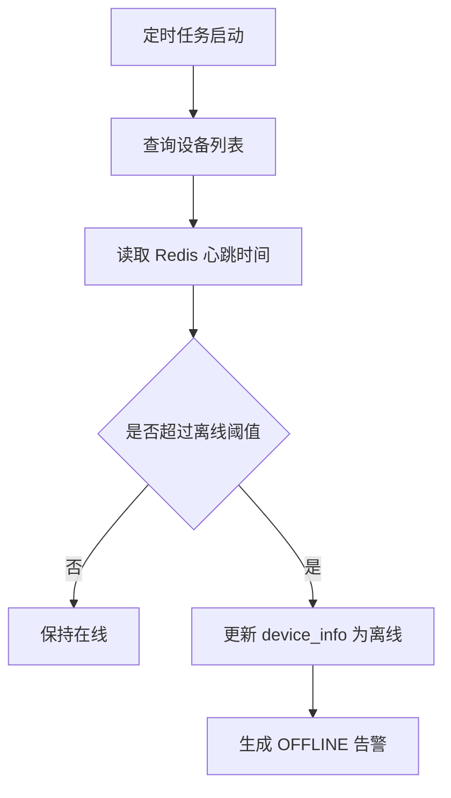

# 05-告警规则设计

## 1. 文档信息

| 项目 | 内容 |
|---|---|
| 项目名称 | 新能源充电设施运行监测与智能告警平台 |
| 文档版本 | v2.0 / 第三阶段 |
| 适用阶段 | 第三阶段：告警规则管理 |
| 编写目的 | 明确告警类型、触发规则、告警等级、去重策略、状态流转、规则管理和后续扩展方向 |

---

## 2. 告警模块定位

告警模块是本项目区别于普通 CRUD 管理系统的核心模块。项目不只是保存设备数据，还需要根据设备运行状态发现异常，并形成可查询、可确认、可恢复、可追踪的告警记录。

当前告警模块能力：

```text
设备运行数据上报 → RabbitMQ 异步告警 → 动态规则检测 → 生成告警记录 → 告警查询 → 告警确认 → 告警恢复
```

后续升级：

```text
WebSocket 实时推送 → 自动创建工单 → 工单处理闭环
```

---

## 3. 告警设计原则

1. **可解释优先**：MVP 使用阈值规则，不使用复杂黑盒模型。
2. **避免刷屏**：同一设备、同一指标、同一类型的未恢复告警不重复创建。
3. **分级处理**：不同严重程度对应不同告警等级。
4. **状态可追踪**：告警从未确认、已确认到已恢复，状态变化清晰。
5. **便于扩展**：规则已通过 `alarm_rule` 表动态配置，支持运行时增删改查和启停。
6. **贴近运维**：告警不是终点，后续应进入工单处理和报表复盘。

---

## 4. MVP 告警类型

MVP 第一版主要实现阈值告警。

| 告警类型 | 编码 | 说明 | MVP 是否实现 |
|---|---|---|---|
| 阈值告警 | THRESHOLD | 指标超过或低于设定阈值 | 是 |
| 离线告警 | OFFLINE | 设备超过指定时间未上报心跳 | ✅ 已实现 |
| 连续异常告警 | CONTINUOUS | 连续 N 次指标异常 | ✅ 已实现，Redis 滑动窗口 |
| 波动异常告警 | FLUCTUATION | 滑动窗口内指标方差或变化率过大 | 预留，第二阶段完善 |
| 组合告警 | COMBINATION | 多个指标同时异常 | 预留，第三阶段可选 |

---

## 5. MVP 阈值规则

规则已通过 `alarm_rule` 表动态配置，支持通过接口增删改查和启停。

当前数据库预置规则：

| 规则编码            | 指标           | 触发条件                | 告警等级 | 告警类型    | 告警说明         |
| ------------------- | -------------- | ----------------------- | -------- | ----------- | ---------------- |
| RULE_TEMP_HIGH      | temperature    | temperature >= 80       | 3 严重   | THRESHOLD   | 设备温度过高     |
| RULE_VOLT_LOW       | voltage        | voltage < 180           | 2 重要   | THRESHOLD   | 设备电压过低     |
| RULE_DELAY_HIGH     | network_delay  | network_delay > 200     | 1 一般   | THRESHOLD   | 网络延迟过高     |
| RULE_DEVICE_OFFLINE | heartbeat      | heartbeat > 60          | 2 重要   | OFFLINE     | 设备离线告警     |
| RULE_TEMP_CONTINUE  | temperature    | temperature > 75        | 3 严重   | CONTINUOUS  | 连续高温告警     |

### 5.1 温度过高告警

```text
规则编码：RULE_TEMP_HIGH
指标名称：temperature
触发条件：temperature > 80
告警等级：严重
告警类型：阈值告警
告警文案：设备温度超过安全阈值，请及时检查散热和运行状态
```

适用场景：

1. 充电桩长时间高功率运行。
2. 设备散热异常。
3. 环境温度过高导致内部温升异常。

---

### 5.2 电压过低告警

```text
规则编码：RULE_VOLT_LOW
指标名称：voltage
触发条件：voltage < 180
告警等级：重要
告警类型：阈值告警
告警文案：设备电压低于正常范围，请检查供电状态
```

适用场景：

1. 站点供电异常。
2. 线路压降过大。
3. 设备输入电压不稳定。

---

### 5.3 网络延迟过高告警

```text
规则编码：RULE_DELAY_HIGH
指标名称：network_delay
触发条件：networkDelay > 200
告警等级：一般
告警类型：阈值告警
告警文案：设备网络延迟较高，请关注通信链路状态
```

适用场景：

1. 设备网络质量下降。
2. 数据上报延迟增加。
3. 通信链路存在波动。

---

## 6. 告警等级设计

| 等级值 | 等级名称 | 含义 | 处理建议 |
|---:|---|---|---|
| 1 | 一般 | 对业务影响较小，需要观察 | 可由运维人员定期查看 |
| 2 | 重要 | 可能影响设备稳定运行，需要处理 | 应及时确认并排查 |
| 3 | 严重 | 可能导致设备故障或服务中断 | 应立即处理 |

### 6.1 等级判定原则

1. 涉及设备安全、温度过高、严重故障的规则设为严重告警。
2. 涉及供电异常、电压异常的规则设为重要告警。
3. 涉及网络延迟、轻微波动的规则设为一般告警。

---

## 7. 告警状态流转

MVP 第一版告警状态包括：

| 状态值 | 状态名称 | 说明 |
|---:|---|---|
| 0 | 未确认 | 系统刚生成告警，尚未被运维人员确认 |
| 1 | 已确认 | 运维人员已经看到并确认该告警 |
| 2 | 已恢复 | 异常已处理或设备状态恢复正常 |

状态流转：



### 7.1 状态说明

#### 未确认

系统检测到异常后创建告警记录，默认状态为未确认。

#### 已确认

运维人员查看告警并确认，系统记录确认人和确认时间。

#### 已恢复

异常已经处理完成，或设备后续数据恢复正常，系统记录恢复时间。

---

## 8. 告警处理流程

### 8.1 同步告警流程（已升级为异步）



### 8.2 异步告警流程（已实现）

当前实际流程：



后续扩展：

```text
告警生成 → WebSocket 推送 → 自动创建工单
```

---

## 9. 告警去重策略

### 9.1 为什么需要去重

设备可能持续处于异常状态，如果每次上报异常数据都创建一条新告警，会导致告警刷屏，使运维人员无法判断真实问题数量。

因此 MVP 第一版采用告警去重机制。

### 9.2 去重维度

同一个未恢复告警由以下维度唯一确定：

```text
设备 ID + 告警类型 + 告警指标 + 告警状态未恢复
```

也可以理解为：

```text
同一设备 + 同一指标 + 同一类型 + 未恢复状态
不重复创建新告警
```

### 9.3 去重处理逻辑

当设备数据触发告警时：

1. 查询 `alarm_record` 表。
2. 条件为：

```text
device_id = 当前设备ID
alarm_type = 当前告警类型
alarm_metric = 当前告警指标
alarm_status in (0, 1)
```

3. 如果不存在，则新增告警记录。
4. 如果存在，则不新增，只更新：

```text
last_time = 当前时间
alarm_count = alarm_count + 1
current_value = 当前值
alarm_message = 最新告警描述
```

### 9.4 伪代码

```java
public void handleThresholdAlarm(DeviceData data, AlarmRule rule) {
    boolean triggered = checkRule(data, rule);
    if (!triggered) {
        return;
    }

    AlarmRecord existing = alarmRecordMapper.selectUnrecoveredAlarm(
        data.getDeviceId(),
        rule.getAlarmType(),
        rule.getMetricName()
    );

    if (existing == null) {
        AlarmRecord record = buildNewAlarm(data, rule);
        alarmRecordMapper.insert(record);
    } else {
        existing.setLastTime(LocalDateTime.now());
        existing.setAlarmCount(existing.getAlarmCount() + 1);
        existing.setCurrentValue(getMetricValue(data, rule.getMetricName()));
        alarmRecordMapper.updateById(existing);
    }
}
```

---

## 10. 告警恢复策略

MVP 第一版采用人工恢复为主。

### 10.1 人工恢复

运维人员处理问题后，调用接口：

```text
PUT /api/alarm/record/{id}/recover
```

系统更新：

```text
alarm_status = 2
recover_time = 当前时间
update_time = 当前时间
```

同时从 Redis 当前告警设备集合中移除该设备，前提是该设备不存在其他未恢复告警。

### 10.2 连续异常窗口清理（已实现）

恢复 CONTINUOUS 告警时，自动清除 Redis 滑动窗口，避免旧窗口数据导致恢复后立即再次触发。

第二阶段可以增加自动恢复逻辑：

1. 如果设备后续连续 N 次数据恢复正常，则自动恢复告警。
2. 自动恢复时记录恢复原因：`设备指标连续恢复正常`。
3. 自动恢复后可同步关闭或更新工单状态。

---

## 11. Redis 告警相关设计

### 11.1 Redis Key

| Key | 类型 | 说明 |
|---|---|---|
| device:alarm:set | Set | 当前存在未恢复告警的设备编号集合 |
| device:status:{deviceCode} | String / Hash | 设备最新运行状态 |
| device:heartbeat:{deviceCode} | String | 设备最近心跳时间 |
| alarm:latest:{deviceCode} | String / Hash，可选 | 设备最新告警摘要 |

### 11.2 写入规则

当设备产生未恢复告警时：

```text
SADD device:alarm:set {deviceCode}
```

当设备所有告警均已恢复时：

```text
SREM device:alarm:set {deviceCode}
```

### 11.3 查询用途

1. 首页展示当前异常设备数量。
2. 快速判断设备是否处于告警状态。
3. 后续 WebSocket 推送时快速组织异常设备列表。

---

## 12. 告警接口设计建议

### 12.1 分页查询告警

```text
GET /api/alarm/record/page
```

查询参数：

| 参数 | 说明 |
|---|---|
| deviceCode | 设备编号 |
| alarmType | 告警类型 |
| alarmLevel | 告警等级 |
| alarmStatus | 告警状态 |
| startTime | 开始时间 |
| endTime | 结束时间 |
| pageNo | 页码 |
| pageSize | 每页数量 |

### 12.2 查询告警详情

```text
GET /api/alarm/record/{id}
```

### 12.3 确认告警

```text
PUT /api/alarm/record/{id}/ack
```

处理逻辑：

```text
1. 查询告警是否存在
2. 判断告警状态是否为未确认
3. 更新 alarm_status = 1
4. 记录 ack_user_id 和 ack_time
```

### 12.4 恢复告警

```text
PUT /api/alarm/record/{id}/recover
```

处理逻辑：

```text
1. 查询告警是否存在
2. 判断告警是否已经恢复
3. 更新 alarm_status = 2
4. 记录 recover_time
5. 检查该设备是否还有其他未恢复告警
6. 如无其他未恢复告警，从 Redis 告警集合移除设备
```

---

## 13. alarm_rule 表设计（已实现）

`alarm_rule` 表已投入使用，规则支持通过接口动态管理。

### 13.1 表字段

| 字段名 | 类型 | 说明 |
|---|---|---|
| id | bigint | 主键，自增 |
| rule_code | varchar(64) | 规则编码，唯一索引 |
| rule_name | varchar(100) | 规则名称 |
| alarm_type | varchar(50) | 告警类型：THRESHOLD / OFFLINE / CONTINUOUS / FLUCTUATION |
| device_type | varchar(10) | 适用设备类型：NULL全部 / AC / DC |
| metric_name | varchar(50) | 指标名称 |
| operator | varchar(10) | 运算符：>、>=、<、<=、=、!= |
| threshold_value | decimal(10,2) | 阈值 |
| window_size | int | 滑动窗口大小 |
| trigger_count | int | 触发次数 |
| alarm_level | tinyint | 告警等级：1一般 2重要 3严重 |
| enabled | tinyint | 是否启用：0禁用 1启用 |
| remark | varchar(255) | 备注 |
| create_time | datetime | 创建时间 |
| update_time | datetime | 更新时间 |
| deleted | tinyint | 逻辑删除 |

### 13.2 管理接口

```text
POST   /api/alarm/rule                 新增告警规则
PUT    /api/alarm/rule/{id}             修改告警规则
DELETE /api/alarm/rule/{id}             删除告警规则
GET    /api/alarm/rule/page             分页查询告警规则
GET    /api/alarm/rule/{id}             查询规则详情
PUT    /api/alarm/rule/{id}/enable      启用规则
PUT    /api/alarm/rule/{id}/disable     禁用规则
```

### 13.3 当前规则数据

| rule_code | rule_name | metric_name | operator | threshold_value | alarm_level |
|---|---|---|---|---:|---:|
| RULE_TEMP_HIGH | 设备高温告警 | temperature | >= | 80 | 3 |
| RULE_VOLT_LOW | 设备低电压告警 | voltage | < | 180 | 2 |
| RULE_DELAY_HIGH | 网络延迟过高告警 | network_delay | > | 200 | 1 |
| RULE_DEVICE_OFFLINE | 设备离线告警 | heartbeat | > | 60 | 2 |
| RULE_TEMP_CONTINUE | 连续高温告警 | temperature | > | 75 | 3 |

---

## 14. 第二阶段连续异常告警设计

连续异常告警用于避免偶发波动造成误报。

示例：

```text
连续 3 次 temperature > 80 才触发严重告警
```

处理方式：

1. 每次设备数据上报后，将指标值写入 Redis 短期窗口。
2. 判断最近 N 次是否均满足异常条件。
3. 满足则触发告警。

Redis Key 示例：

```text
alarm:window:{deviceCode}:{metricName}
```

数据结构：List。

---

## 15. 第二阶段离线告警设计

离线告警用于判断设备是否长时间未上报。

规则示例：

```text
当前时间 - last_heartbeat > 60 秒
```

处理方式：

1. 设备每次上报时更新 `device:heartbeat:{deviceCode}`。
2. 定时任务每隔一段时间扫描设备。
3. 若超过离线阈值，则标记设备离线并生成离线告警。

流程：



---

## 16. 第二阶段波动异常告警设计

波动异常用于检测指标短时间内剧烈变化。

示例：

```text
最近 5 分钟 power 方差 > 阈值
```

可用统计量：

1. 均值。
2. 方差。
3. 最大最小差值。
4. 变化率。
5. Z-score。

建议简历表达：

```text
结合阈值规则、连续异常次数和滑动窗口统计实现轻量级异常告警。
```

---

## 17. 告警与工单衔接，第二阶段

MVP 阶段告警只做到确认和恢复。

第二阶段建议加入工单闭环：

```text
告警生成 → 自动创建工单 → 派发运维人员 → 处理故障 → 确认结果 → 关闭工单 → 恢复告警
```

告警与工单关系：

```text
alarm_record 1 : 1 work_order
```

也可以设计为：

```text
一个告警最多生成一个未关闭工单
```

避免同一告警重复创建多个工单。

---

## 18. 告警模块验收标准

| 编号 | 验收项 | 验收标准 |
|---|---|---|
| 1 | 温度告警 | 上报 temperature > 80 时生成严重告警 |
| 2 | 电压告警 | 上报 voltage < 180 时生成重要告警 |
| 3 | 网络延迟告警 | 上报 networkDelay > 200 时生成一般告警 |
| 4 | 告警去重 | 同一设备同一指标未恢复时不重复创建新告警 |
| 5 | 告警次数 | 重复异常时 alarm_count 自动增加 |
| 6 | 最近发生时间 | 重复异常时 last_time 自动更新 |
| 7 | 告警查询 | 可以按设备、类型、等级、状态分页查询 |
| 8 | 告警确认 | 未确认告警可以更新为已确认 |
| 9 | 告警恢复 | 未恢复告警可以更新为已恢复 |
| 10 | Redis 集合 | 当前异常设备编号可以写入 device:alarm:set |

---

## 19. 告警设计总结

告警模块当前完整能力：

```text
动态 alarm_rule 规则 + Redis 缓存 + Redis 滑动窗口
+ THRESHOLD / OFFLINE / CONTINUOUS 三种告警类型
+ 告警去重 + 状态流转 + WebSocket 推送 + 自动工单
```

完整链路：

```text
设备上报异常数据 → RabbitMQ 异步检测 → 告警生成
→ WebSocket 实时推送 → 严重告警自动建单 → 工单流转处理
```
